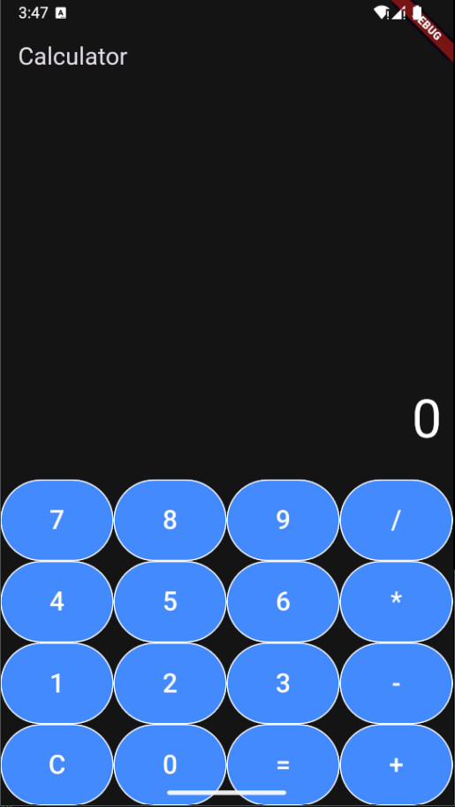

# Calculator App

A simple yet elegant calculator application built using Flutter. This app provides basic arithmetic operations and a user-friendly interface.



## Features

- **Basic Arithmetic Operations**: Addition, Subtraction, Multiplication, and Division.
- **User-Friendly Interface**: Intuitive design for easy navigation.
- **Dark Theme**: Modern dark theme for a comfortable viewing experience.
- **Error Handling**: Graceful error handling for invalid expressions.

## Getting Started

### Prerequisites

Make sure you have Flutter installed on your machine. Follow the official Flutter installation guide [here](https://flutter.dev/docs/get-started/install).

### Installation

1. Clone the repository:
   ```bash
   git clone https://github.com/username/calculator_app.git
   cd calculator_app
